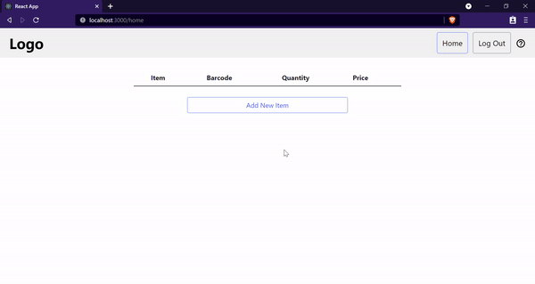
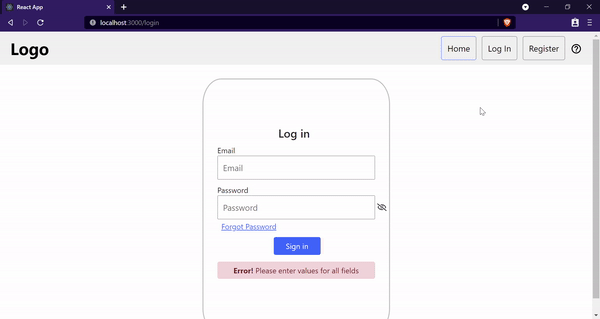
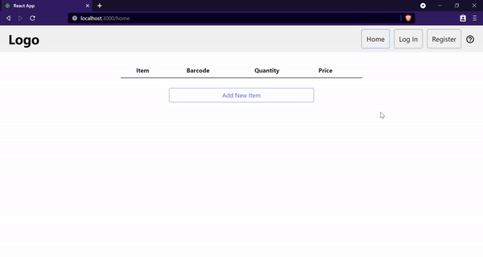

# Inventory App
Add, view, and delete inventory using the MERN stack.

## Demo
### Home

### Login

### Register

## Stack
  - Node.js
  - Express
  - Mongoose
  - MongoDB
  - React
  - Bootstrap

## Setup
To run the project, install the project locally using npm
  - npm install

## How to Use
  - View already saved inventory items in the table
  - Add new items in the form below by clicking the "add" button
  - Delete items in the table with the "trash" button

 
 

Authentication learned from TraversyMedia.
